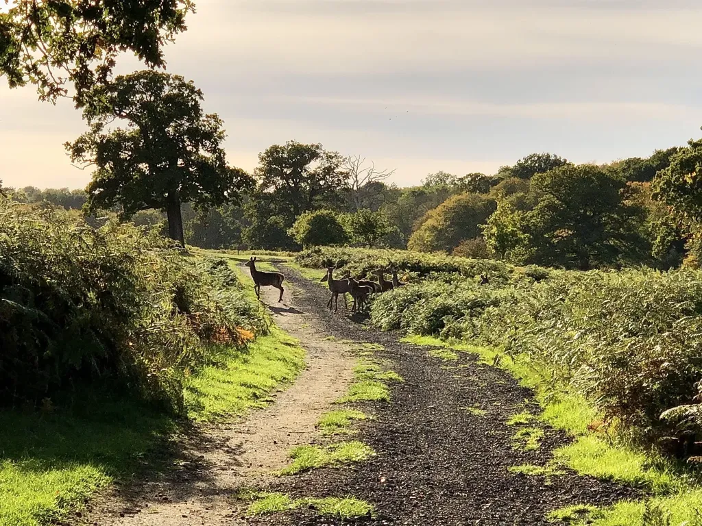

# Walking the STOOP for The Brain Tumour Charity on May 25th and 26th

**[The Brain Tumour Charity](https://www.thebraintumourcharity.org/)** is the world’s leading brain tumour charity and the largest dedicated funder of research into brain tumours globally.

Many of us have family, friends or colleagues that have been affected by brain tumours. What better way to raise money for this worthy cause than spending the weekend of May 25th/26th walking the 27 mile STOOP amongst friends.

**[Please click here if you would like to make a donation via JustGiving](https://www.justgiving.com/team/stoop)**

*Old Knebworth and Norton Green, Credit: Steve Pearcy, 2022*

The STOOP or the **[Stevenage Outer Orbital Path](https://nhrg.org.uk/stoop-stevenage-outer-orbital-path.html)** is an approximately 27 mile series of linked paths forming a circle surrounding Stevenage. It passes through pretty villages, past some lovely pubs, and meanders alongside streams and hedgerows.

The **[Broken Seal walkers](https://www.facebook.com/brokensealtap/)** are a group that regularly walks in the countryside around Stevenage and mostly met in the Stevenage Old Town taproom of the same name.

## Itinerary and Logistics

The walk will be split into two days of roughly equal length and each day then split into two halves. Joining us for both days, one day or a part of a day would be amazing. Included below is a map of the route from the North Herts Ramblers’ **[great overview](https://nhrg.org.uk/stoop-stevenage-outer-orbital-path/15-stoop/31-stoop-outline.html)**. We will have a few OS explorer route maps available so we don’t need to travel as one large group.

<iframe src="https://www.google.com/maps/d/embed?mid=1T4pLkqmm_uFzT2UgpAP9KmZA-gnB6QEH&ehbc=2E312F" width="640" height="480"></iframe>

This page will be updated with more information including exact coordinates of start and end points and map details nearer the event.

### Day 1 ~ 13.5 miles

- 10 AM – meet in Weston to start

- 1 PM (approx) – Aston Ford

- 4 PM (approx) – Lytton Arms, Old Knebworth

### Day 2 ~ 13.5 miles

- 10 AM – meet at Lytton Arms, Old Knebworth

- 1 PM (approx) – Rusty Gun

- 4 PM (approx) – Cricketers, Weston to end

### What you need to bring if you want to join us

Clearly the wilds of Stevenage are not, ahem, that wild… Even so, it is a good idea to:

- Wear appropriate footwear and clothing. Waterproofs are definitely a good idea as are layers. It could be wet and windy; equally given the time of year it could be baking hot.
- Sunscreen
- Water
- Snacks
- Lunch if you are planning on joining for the full day (definitely bring food, a sugar crash after 7 miles makes the next 7 no fun at all!)

Disclaimer: this is a privately organised walk for charity, as such the organisers accept no liability in the event of injury to participants.
